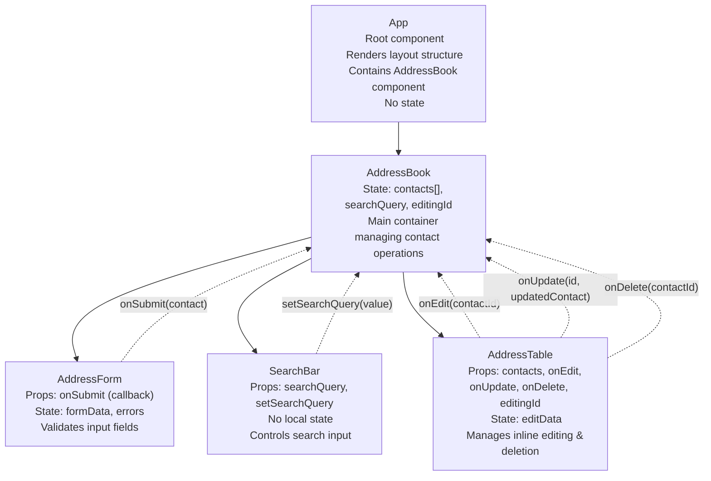

# Diagram

## Explanation
AddressBook: зберігає масив контактів contacts[], пошуковий запит searchQuery та ID редагованого контакту editingId. Керує всіма операціями додавання, оновлення, видалення контактів та фільтрацією за пошуковим запитом.

AddressForm: керує локальним станом форми formData (firstName, lastName, phone) та станом помилок errors. Валідує обов'язкові поля та передає новий контакт в AddressBook через callback onSubmit.

SearchBar: не має власного стану, лише отримує поточний searchQuery та функцію setSearchQuery для оновлення пошукового запиту в AddressBook. Контролює поле пошуку.

AddressTable: отримує відфільтрований масив contacts та callback-функції для редагування, оновлення та видалення. Керує локальним станом editData для inline редагування рядків таблиці. Передає виклики до AddressBook через onEdit, onUpdate та onDelete.

App: не має стану, служить лише кореневою обгорткою і рендерить компонент AddressBook.

## Patterns
Lifting State Up - стан contacts піднято до AddressBook для спільного використання між формою, пошуком та таблицею.

Unidirectional Data Flow - дані течуть вниз через props (суцільні стрілки), події течуть вгору через callbacks (пунктирні стрілки).

Component Composition - App складається з AddressBook, який у свою чергу складається з трьох дочірніх компонентів.

Controlled Components - AddressForm контролює стан форми через React state.

List Rendering Pattern - дозволяє динамічно рендерити будь-яку кількість рядків таблиці на основі масиву даних.
